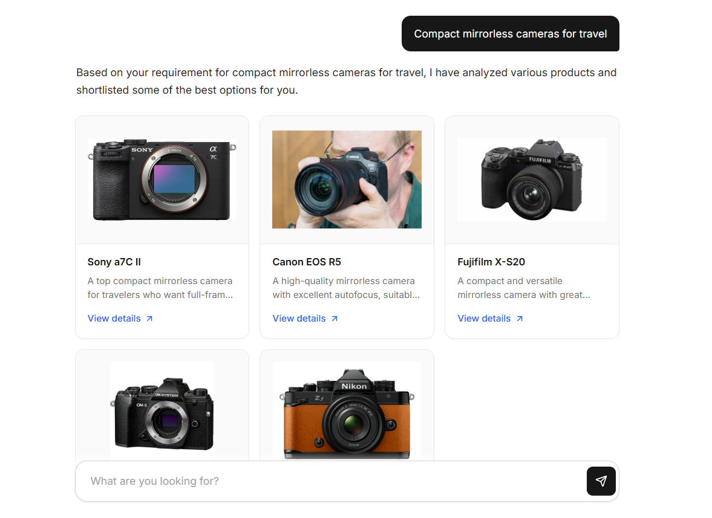

<h1 align="center"> PickSmart 🛒 </h1>
<div align="center">
   
</div>
<br>
<p align="center">
AI-powered shopping assistant platform for real-time product search with contextual question-answering and personalized product recommendations empowered by the intelligent search and analyst agent:
</p>
<br>

## 🎥 Overview




PickSmart is an AI-powered product discovery platform that leverages the large language model and intelligent agents to provide real-time product search, contextual question-answering, and personalized product recommendations. The system integrates a Retrieval-Augmented Generation (RAG) architecture with a search agent (Hybrid RAG) for product discovery across multiple e-commerce marketplaces.


## 🚀 Features
|   Name  | Description |
|-------|-------------|
| **Ask a question about a product** | Submit a query to get detailed information, including specifications, pricing, and availability. |
| **Search multiple marketplaces and rank the results**| The system aggregates product listings from various online marketplaces, compares and ranks them based on relevance, price, and customer reviews. |
| **Receive personalized recommendations** |  Get AI-driven suggestions tailored to users' preferences, helping users make informed decisions. |

## ⚡Core Capabilities
|  Function | Description |
|-----------|-------------|
|**Natural Language Query Processing** | Advanced query decomposition and semantic analysis
| **Vector Database Integration** | Efficient data ingestion and storage for embedding-based semantic retrieval.
| **Distributed Real-time Search** | Multi-marketplace product discovery with parallel processing
| **Intelligent Product Ranking** | AI-powered relevance scoring and personalization
| **Context-Aware Recommendations** | Detailed answers with product suggestions
| **Scalable Data Processing** | Event-driven architecture for high-throughput data handling

## 🛠️ Tech Stack
- **Frontend**: React, Vite
- **Backend**: FastAPI
- **Build Tool**: Vite (migrated from CRA)
- **Containerization**: Docker
- **Streaming**: Kafka
- **RAG System**: LangChain, MongoDB (vector store)
- **Agents**: LangGraph, Tavily (search)

## 📐System Architecture

Coming Soon...

### Frontend Layer
- **Framework**: React.js with TypeScript
- **State Management**: Redux for predictable state container
- **API Integration**: Axios for HTTP client
- **Styling**: Custom CSS with modern SaaS design principles

### Backend Services
- **API Framework**: FastAPI with asynchronous request handling and high-performance routing
- **Vector Store**: MongoDB for efficient similarity search and embedding storage
- **Search Engine**: Tavily API integration for real-time and accurate web search capabilities

### AI Components
- **LLM Integration**: Groq API for high-performance inference
- **Agent Framework**: LangChain for composable AI components
- **Workflow Orchestration**: LangGraph for agent coordination and planning
- **RAG System**: MongoDB for vector index implementation and semantic retrieval

### Agent Workflow

The system implements a search and analyst agent with a multi-step workflow using LangGraph for orchestration:

```python
graph = StateGraph(SearchAgentState)
graph.add_node("analyze_query", self.analyze_query_node)
graph.add_node("search_online_shop", self.search_online_node)
graph.add_node("analyze_and_rank", self.analyze_rank_node)
graph.add_node("search_product_source", self.search_source_node)
graph.set_entry_point("analyze_query")
graph.add_edge("analyze_query", "search_online_shop")
graph.add_edge("search_online_shop", "analyze_and_rank")
graph.add_edge("analyze_and_rank", "search_product_source")
graph.set_finish_point("analyze_and_rank")
self.graph = graph.compile(checkpointer=checkpointer)
```

The search and analyst agent progresses through the following sequential states:

| State | Name | Description |
|:-----:|-------|-------------|
|   1   | 🔍 **Query Analysis State** | Analyzes and decomposes the user query before identifying search intent and extracts key product attributes, serving as the entry point for all search requests |
|   2   | 🛒 **Online Shop Search State** | Performs search across multiple online websites, retrieves initial product information from available sources, and gathers raw product data for further analysis |
|   3   | ⭐ **Analysis and Ranking State** | Evaluates and ranks products using multiple criteria, prioritizing results based on relevance and quality to deliver the most appropriate options to users |
|   4   | 🔗 **Product Source Search State** | Extends search to discover additional product sources across e-commerce platforms, provides a direct purchasing link, and validates product availability |

The workflow follows a linear progression through these states, from which each state is built upon the results of the previous states.

## 📂 Folder Structure

This project contains a Vite React frontend and a FastAPI backend.

```bash
PickSmart
├── docker-compose.yaml             # Multi-service local deployment
├── LICENSE                         # Project license
├── README.md                       # Project documentation
├── chatbot-app                     # Frontend application (React + Vite)
│   ├── .env                        # Frontend environment variables
│   ├── Dockerfile                  # Frontend container definition
│   ├── index.html                  # Vite HTML entry
│   ├── package.json                # Frontend dependencies and scripts
│   ├── package-lock.json           # Frontend dependency lockfile
│   ├── vite.config.js              # Vite configuration
│   ├── public                      # Public static assets
│   ├── src                         # Frontend source code
│   │   ├── App.css                 # Main UI styles
│   │   ├── App.jsx                 # Main app component
│   │   ├── App.test.js             # Frontend test file
│   │   ├── index.css               # Global styles
│   │   ├── main.jsx                # React entrypoint
│   │   ├── reportWebVitals.js      # Performance metrics helper
│   │   └── setupTests.js           # Test setup
│   └── build                       # Static build output
└── chatbot-server                  # Backend application (FastAPI)
	├── .env                        # Backend environment variables
	├── Dockerfile                  # Backend container definition
	├── model.yaml                  # LLM model config
	├── requirements.txt            # Python dependencies
	├── __init__.py
	└── src                         # Backend source code
		├── __init__.py
		├── chatbot.py              # Core chatbot logic
		├── main.py                 # FastAPI entrypoint
		├── agent                   # Search agent workflow
		├── constants               # Prompt and constants
		├── data                    # Data models
		├── service                 # Service layer
		└── utils                   # Utility helpers
```
   
## ⚙️ Configuration

### Environment Variables
Create ```.env``` file under ```chatbot-server``` folder and add API keys and MongoDB configuration as below:

```env
GROQ_API_KEY="<API_KEY>"
TAVILY_API_KEY="<API_KEY>"
CO_API_KEY="<API_KEY>"
MONGO_USER_NAME="<USERNAME>"
MONGO_PASSWORD="<PASSWORD>"
MONGO_CLUSTER="picksmart-cluster"
MONGO_DATABASE="picksmart"
```
- To get Groq api key: https://console.groq.com/keys
- To get Tavily api key: https://tavily.com/
- To get Cohere api key: https://dashboard.cohere.com/
- To set up MongoDB: https://www.mongodb.com/

### Model Configuration

Configure the LLM model in ```model.yaml``` file:
```yaml
LLM: <LLM_MODEL>
```

## 🚢 Deployment

### Docker Deployment
The application supports containerized deployment using Docker and Docker Compose for simplified orchestration.

- **Docker**: Multi-service orchestration with Docker Compose
- **Environment Variables**: Managed via `.env` files, using `VITE_BACKEND_URL` for frontend-backend communication

1. Clone the repository:
```bash
git clone https://github.com/phrugsa-limbunlom/PickSmart.git
cd PickSmart
```

2. Create the network:
```bash
docker network create chatbot-network
```

3. Deploy services:
```bash
docker-compose up --build
```

The application will be accessible at `localhost:3000`.

### Manual Installation

1. Clone the repository:
```bash
git clone https://github.com/phrugsa-limbunlom/PickSmart.git
cd PickSmart
```

2. Install backend dependencies:
```bash
pip install -r /chatbot-server/requirements.txt
```

3. Install frontend dependencies:
```bash
cd chatbot-app
npm install
```

4. Initialize Kafka services

5. Launch backend server:
```bash
uvicorn main:app --reload
```

6. Start frontend application:
```bash
npm start
```

## 💻 System Requirements
- Python 3.8+
- Node.js 14+
- Docker 20.10+
- Docker Compose 2.0+
- 8GB RAM minimum
- 4 CPU cores recommended

## 📜 License
PickSmart is released under the MIT License. See the [LICENSE](https://github.com/phrugsa-limbunlom/PickSmart/blob/main/LICENSE) file for more details.
